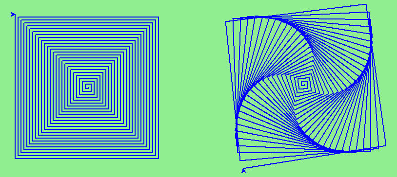

# Exercises

## Exercise 1

Write a void (non-fruitful) function draw a square. Use it to draw the image below, assume each side is 20 units.

Hint: Notice that the turtle has already moved away from the ending point of the last square when the program ends.

## Exercise 2

Write a program to draw this. Assume the innermost square is 20 units per side, and each successive square is 20 units larger, per side, than the one inside of it.

## Exercise 3

Write a void function draw_poly(t, n, sz) which makes a turtle draw a regular polygon. When called with draw_poly(tess, 8, 50), it will draw a shape like this:

## Exercise 4

These two spirals differ only by the turn angle. Draw both.

